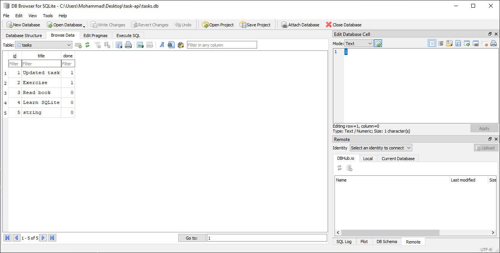

# Task API

A simple REST API built with **FastAPI** and **SQLite** that allows users to create, read, update, and delete tasks.

## Features

- Create tasks
- Read all tasks
- Read a task by ID
- Update tasks
- Delete tasks
- Store data permanently using SQLite

## Technologies

- Python
- FastAPI
- SQLite
- Uvicorn

## Why SQLite?

SQLite was chosen because it is lightweight, requires no separate server, and stores all data in a single database file. It is perfect for learning backend development and building small applications.

## Database

The application automatically creates a SQLite database named:

```
tasks.db
```

When the application starts:

- The database is created if it does not exist.
- The `tasks` table is created automatically.
- Three example tasks are inserted only if the table is empty.

## Project Structure

```
task-api/
│
├── images/
│   └── database.png
├── main.py
├── tasks.db
├── requirements.txt
├── README.md
└── .gitignore
```

## Installation

Clone the repository:

```bash
git clone https://github.com/mohammad0000am-coder/task-api.git
```

Move into the project:

```bash
cd task-api
```

Create a virtual environment:

```bash
python -m venv venv
```

Activate it (Windows):

```powershell
.\venv\Scripts\Activate.ps1
```
Create virtual environment:
```bash
python -m venv venv
```
Activate environment:

Windows:
```bash

.\venv\Scripts\Activate.ps1
```
Install dependencies:
```bash

```bash
pip install -r requirements.txt
```

Run the server:

Run server:
```bash

```bash
uvicorn main:app --reload
```

## API Endpoints

| Method | Endpoint | Description |
|---------|----------|-------------|
| GET | /tasks | Get all tasks |
| GET | /tasks/{id} | Get one task |
| POST | /tasks | Create a task |
| PUT | /tasks/{id} | Update a task |
| DELETE | /tasks/{id} | Delete a task |

## Example SQL Query

```sql
SELECT * FROM tasks WHERE done = 1;
```

This query returns all completed tasks.

## Database Screenshot

The database was inspected using DB Browser for SQLite.



## API Documentation

After running the server:

```
http://127.0.0.1:8000/docs
```

## Author

Mohammad
http://127.0.0.1:8000/docs
## API Endpoints

| Method | Endpoint | Description |
|--------|----------|-------------|
| GET | `/` | API information |
| GET | `/health` | Health check |
| GET | `/tasks` | Get all tasks |
| GET | `/tasks/{id}` | Get one task |
| POST | `/tasks` | Create a task |
| PUT | `/tasks/{id}` | Update a task |
| DELETE | `/tasks/{id}` | Delete a task |

